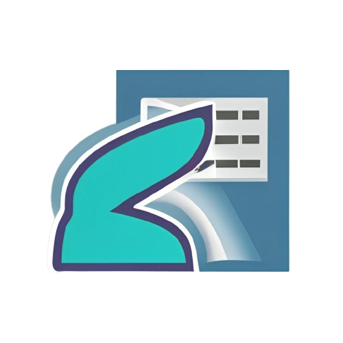

# **Data Task Accelerator** 

<!--
[](https://pypi.org/project/data-task-accelerator)
[](https://pepy.tech/project/data-task-accelerator)
-->

[](https://github.com/psf/black)
[](https://pycqa.github.io/isort/)

This library simplifies working with data through a cluster of functions that accelerate developer productivity. Whether in the fields of data processing, process automation, database management, among others.

## Installing

When the project is complete, you can install it using `pip`.

```
$ pip install data-task-accelerator
```

For more information on setting up your Python development environment, please refer to [Python Development Environment Setup Guide](https://cloud.google.com/python/setup).

## Extras

Nothing for now.

### Supported Python Versions

> Python >= 3.10.6

### Unsupported Python Versions

> Python == 3.6

### Used Python Libraries Versions

To install project running requirements run

```py
pip install requirements.txt
```

## Documentation

The Data Task Accelerator has usage and reference documentation [in the not too distant future](https://youtu.be/dQw4w9WgXcQ?t=85).

## Current Maintainers

-   https://linkedin.com/in/lucasomarandradeleal

## Authors

-   [@lucasoal](https://github.com/lucasoal) (Lucas Omar)

## Contributing

Contributions to this library are always welcome and highly encouraged.

See [CONTRIBUTING.md](./CONTRIBUTING.md) for more information on how to get started.

## References

-   https://python.plainenglish.io/create-a-python-trading-library-719a471bb367
-   https://medium.com/analytics-vidhya/how-to-create-a-python-library-7d5aea80cc3f
-   https://semaphoreci.com/community/tutorials/testing-python-applications-with-pytest
